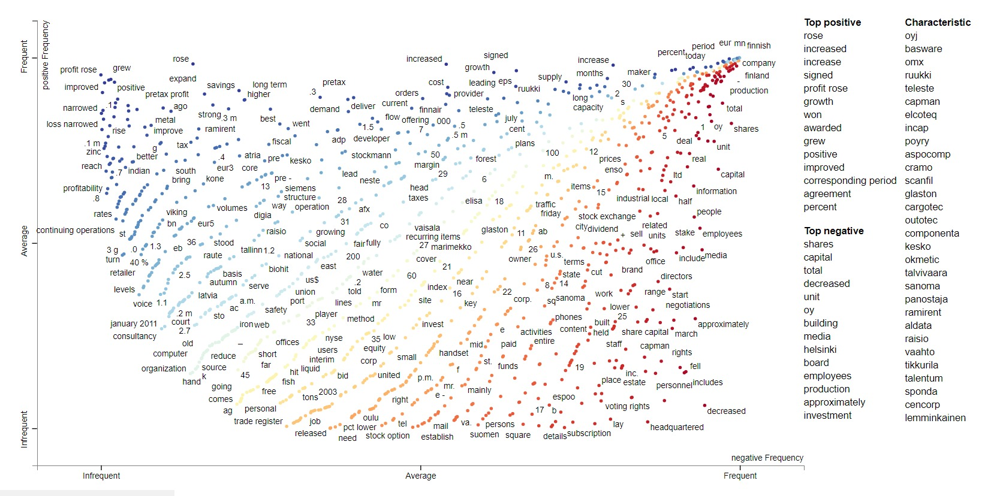

# Sentiment Classifier



This project is a learning exercise that focuses on using MLflow and spaCy for Natural Language Processing (NLP) projects. The goal is to develop a sentiment classifier using these tools. MLflow is a platform for managing the machine learning lifecycle, while spaCy is a popular NLP library in Python. By combining these technologies, we aim to build an effective sentiment classifier that can analyze and classify the sentiment of text data.

## Project Setup

To set up the sentiment classifier project, follow these steps:

1. Clone the repository to your local machine.

```bash
git clone https://github.com/manuelgilm/NLP_usecases.git
cd sentiment_classifier
```
2. Install the project using poetry:

    ```bash
    poetry install 
    ```

This will create a virtual environment within the project folder. 

3. Download the necessary language models for spaCy by executing the following command:

    ```bash
    poetry run spacy download en_core_web_lg
    ```

4. Downloading the dataset.

* The dataset can be downloaded from [Kaggle](https://www.kaggle.com/datasets/ankurzing/sentiment-analysis-for-financial-news).
* Make sure the data source folder points to the right location on your PC. For the code to work, the source data folder has to be inside the `sentiment_classifier` project folder.

## Creating training and testing Datasets.

Run the following command to create the datasets in Binary format.

```bash
poetry run create_binary_dataset
```

## Training the model.

You can adjust the training process using the configuration files under `sentiment_classifier/configs/training/`

```bash
poetry run train
```

## Batch Inference 

Once a ML model is available in MLflow Model Registry. You can get predictions by running.

```bash
poetry run predict
```

NOTE: This will use the dataset that was created for validation purposes during the training phase.

## Online Inference 

1. Deploy the model in your local machine by running. 

```bash
poetry run mlflow models serve -m models:/sentiment_classifier@Champion -p 5000 --no-conda
```

2. Get predictions by running.

```bash 
poetry run score --model_input "According to Gran , the company has no plans to move all production to Russia , although that is where the company is growing."
```

## Conclusion

In this project, we have explored the use of MLflow and spaCy for developing a sentiment classifier for Natural Language Processing (NLP) tasks. By combining these technologies, we were able to build an effective sentiment classifier that can analyze and classify the sentiment of text data.

The project setup involved cloning the repository, installing the project dependencies using poetry, and downloading the necessary language models for spaCy. We also downloaded the dataset from Kaggle and ensured that the data source folder was correctly located within the project.

To create the training and testing datasets, we ran the `create_binary_dataset` command. This command generated the datasets in binary format, which were used for training the model.

The training process was customizable through the configuration files under `sentiment_classifier/configs/training/`. We trained the model using the `train` command.

For batch inference, we used the ML model available in the MLflow Model Registry. By running the `predict` command, we obtained predictions using the dataset created for validation during the training phase.

For online inference, we deployed the model on our local machine using the `mlflow models serve` command. We then obtained predictions by running the `score` command with the desired input text.

Overall, this project provided a hands-on experience in using MLflow and spaCy for sentiment classification in NLP projects. It demonstrated the importance of proper project setup, dataset creation, model training, and inference. With further enhancements and fine-tuning, this sentiment classifier can be applied to various real-world applications.


## Contributing

If you want to contribute to this project and make it better, your help is very welcome. Contributing is also a great way to learn more and improve your skills. You can contribute in different ways:

* Reporting a bug
* Coming up with a feature request
* Writing code
* Writing tests
* Writing documentation
* Reviewing code
* Giving feedback on the project
* Spreading the word
* Sharing the project

## Contact

If you need to contact me, you can reach me at:

- [manuelgilsitio@gmail.com](manuelgilsitio@gmail.com)
- [linkedin](www.linkedin.com/in/manuelgilmatheus)
  